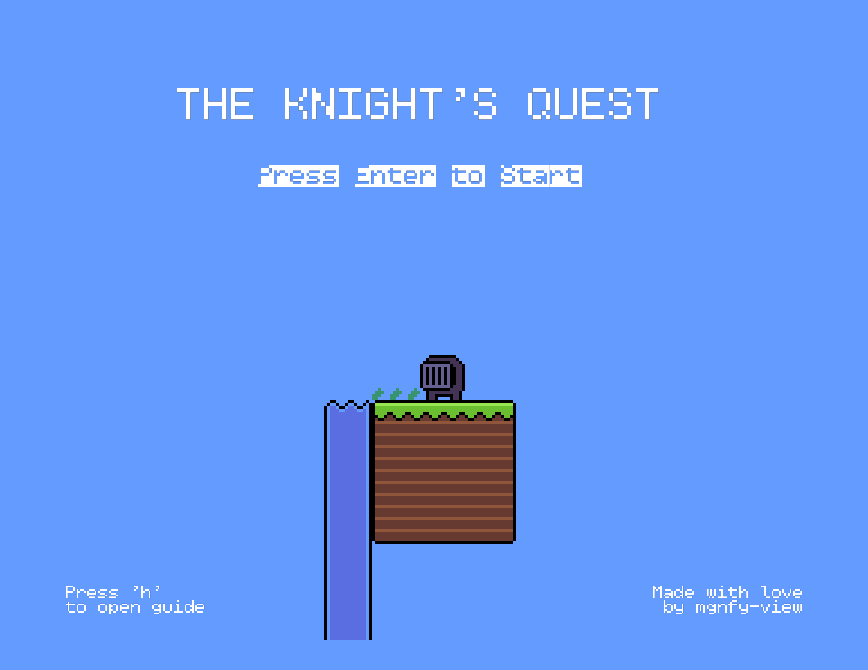
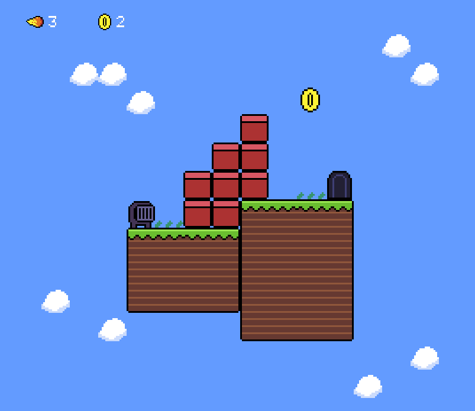
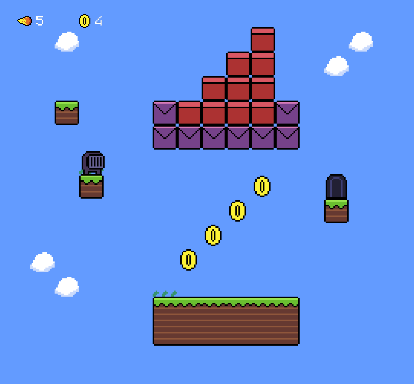
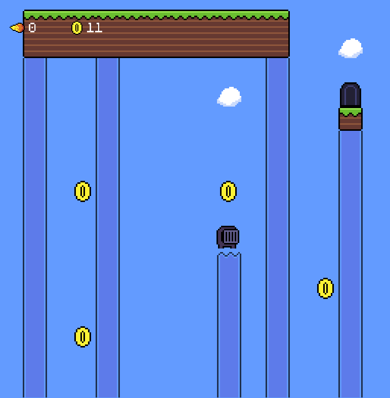

<!-- PROJECT SHIELDS -->
<!--
*** I'm using markdown "reference style" links for readability.
*** Reference links are enclosed in brackets [ ] instead of parentheses ( ).
*** See the bottom of this document for the declaration of the reference variables
*** for contributors-url, forks-url, etc. This is an optional, concise syntax you may use.
*** https://www.markdownguide.org/basic-syntax/#reference-style-links
-->
[![Contributors][contributors-shield]][contributors-url]
[![Forks][forks-shield]][forks-url]
[![Stargazers][stars-shield]][stars-url]
[![Issues][issues-shield]][issues-url]
[![MIT License][license-shield]][license-url]


<!-- PROJECT LOGO -->
<br />
<div align="center">
  <a href="https://github.com/mgnfy-view/the-knights-quest">
    
  </a>

  <h3 align="center">The Knight's Quest</h3>

  <p align="center">
    A bite-sized platforming game with a greedy knight
    <br />
    <a href="https://github.com/mgnfy-view/the-knights-quest/issues/new?labels=bug&template=bug-report---.md">Report Bug</a>
    ·
    <a href="https://github.com/mgnfy-view/the-knights-quest/issues/new?labels=enhancement&template=feature-request---.md">Request Feature</a>
  </p>
</div>


<!-- TABLE OF CONTENTS -->
<details>
  <summary>Table of Contents</summary>
  <ol>
    <li>
      <a href="#about-the-project">About The Project</a>
      <ul>
        <li><a href="#built-with">Built With</a></li>
      </ul>
    </li>
    <li>
      <a href="#getting-started">Getting Started</a>
      <ul>
        <li><a href="#prerequisites">Prerequisites</a></li>
        <li><a href="#installation">Installation</a></li>
      </ul>
    </li>
    <li><a href="#usage">Usage</a></li>
    <li><a href="#roadmap">Roadmap</a></li>
    <li><a href="#contributing">Contributing</a></li>
    <li><a href="#license">License</a></li>
    <li><a href="#contact">Contact</a></li>
  </ol>
</details>


<!-- ABOUT THE PROJECT -->
## About The Project



The knight's quest is a platforming game built with javascript and kaboom.js, a javscript based game engine. With bite-sized but well thought levels, simple controls, and a decent set of mechanics, it is a great choice for a small gaming session.

More levels will be added over time!


### Built With

- ![JavaScript][javascript-url]
- 
- ![PNPM][pnpm-url]


<!-- GETTING STARTED -->
## Getting Started

### Prerequisites

Make sure you have git and pnpm installed and configured on your system.

### Installation

Clone the repo and cd into it

```shell
git clone https://github.com/mgnfy-view/the-knights-quest
cd the-knights-quest
```

Install the project's dependencies

```shell
pnpm install
```

Start the server to run the game locally with

```shell
pnpm run dev
```

Thats' it, you should be ready to go now.


<!-- USAGE EXAMPLES -->
## Usage

You can use the arrow keys to move left and right. Press the spacebar to jump and x to shoot fire balls. Fire balls can destroy tiles (red block) as well as scaffolds (purple blocks). Water elevators allow you to climb greater heights. Collect as many coins as possible on your quest.

Here are some in-game screenshots








<!-- ROADMAP -->
## Roadmap

- [x] Make a sprite sheet
- [x] Design levels
- [x] Develop the game with javascript and kaboom.js
  - [x] Add scenes
  - [x] Add global state
  - [x] Add a menu and ending screen
  - [ ] Code review and cleanup
- [x] Write a good README.md

See the [open issues](https://github.com/mgnfy-view/the-knights-quest/issues) for a full list of proposed features (and known issues).


<!-- CONTRIBUTING -->
## Contributing

Contributions are what make the open source community such an amazing place to learn, inspire, and create. Any contributions you make are **greatly appreciated**.

If you have a suggestion that would make this better, please fork the repo and create a pull request. You can also simply open an issue with the tag "enhancement".
Don't forget to give the project a star! Thanks again!

1. Fork the Project
2. Create your Feature Branch (`git checkout -b feature/AmazingFeature`)
3. Commit your Changes (`git commit -m 'Add some AmazingFeature'`)
4. Push to the Branch (`git push origin feature/AmazingFeature`)
5. Open a Pull Request

I'd love to see contributions that add more levels to game. You don't have to write a single line of code to submit levels. Use the spritesheet from `./public/spriteSheets/spriteSheet.png` and the tiled map editor to create a level. Export the map in the `.tmx` form in the `./public/tiled` folder, and create a pull request. It's that easy!


<!-- LICENSE -->
## License

Distributed under the MIT License. See `LICENSE.txt` for more information.


<!-- CONTACT -->
## Contact

Here's a gateway to all my socials, don't forget to hit me up!

[][linktree-url]


<!-- MARKDOWN LINKS & IMAGES -->
<!-- https://www.markdownguide.org/basic-syntax/#reference-style-links -->
[contributors-shield]: https://img.shields.io/github/contributors/mgnfy-view/the-knights-quest.svg?style=for-the-badge
[contributors-url]: https://github.com/mgnfy-view/the-knights-quest/graphs/contributors
[forks-shield]: https://img.shields.io/github/forks/mgnfy-view/the-knights-quest.svg?style=for-the-badge
[forks-url]: https://github.com/mgnfy-view/the-knights-quest/network/members
[stars-shield]: https://img.shields.io/github/stars/mgnfy-view/the-knights-quest.svg?style=for-the-badge
[stars-url]: https://github.com/mgnfy-view/the-knights-quest/stargazers
[issues-shield]: https://img.shields.io/github/issues/mgnfy-view/the-knights-quest.svg?style=for-the-badge
[issues-url]: https://github.com/mgnfy-view/the-knights-quest/issues
[license-shield]: https://img.shields.io/github/license/mgnfy-view/the-knights-quest.svg?style=for-the-badge
[license-url]: https://github.com/mgnfy-view/the-knights-quest/blob/master/LICENSE.txt
[javascript-url]: https://img.shields.io/badge/Javascript-%23323330.svg?style=for-the-badge&logo=javascript&logoColor=%23F7DF1E
[pnpm-url]: https://img.shields.io/badge/pnpm-%234a4a4a.svg?style=for-the-badge&logo=pnpm&logoColor=f69220
[linktree-url]: https://linktr.ee/mgnfy.view
